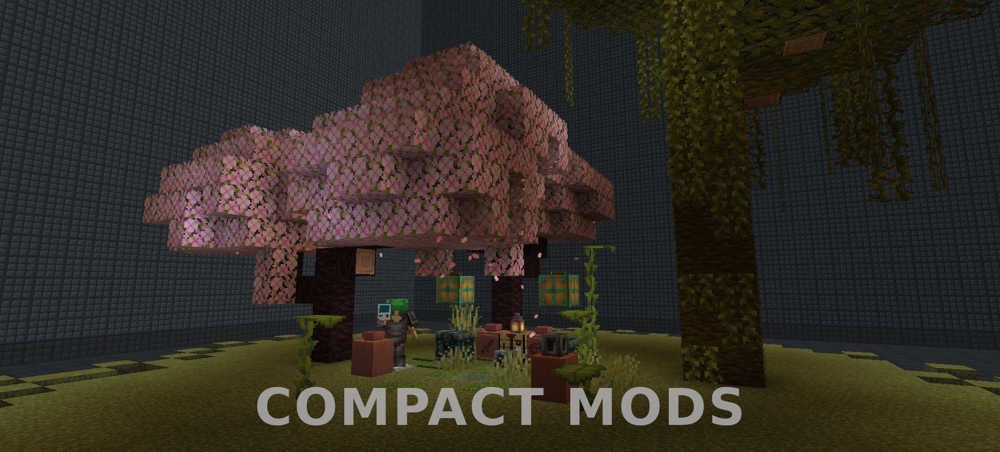

### Current Status: Porting to 26.1, Bugfixing 21.1

|                  | 16.5 | 18.2 | 19.2 | 20.1 | 20.6 | 21.1 | 21.4 | 26.1
|-----------------:|:-:|:-:|:-:|:-:|:-:|:-:|:-:|:-:|
|                  |🔥|🔥|🔥|🔥|🦊|🦊|🦊|🦊|
|     **Machines** |🟦|🟦|🟦|🟦|🪛|🟦|⬛|🟨|
|     **Crafting** |🟦|🟦|🟦|⬛|⬛|🪛|⬛|🟨|
| **Simple Honey** |⬛|⬛|⬛|⬛|🟦|🟦|🟦|🟥|
|       **Gander** |⬛|⬛|⬛|⬛|🟦|🟩|⬛|🟨|
|      **Spatial** |⬛|⬛|⬛|🟦|🟦|🟦|⬛|🟥|

**​**

**Color Meanings/Legend**

|    | Status             | Meaning                                                                                     |
|:--:|--------------------|---------------------------------------------------------------------------------------------|
| ⬛  | Unavailable        | Version not planned.                                                                        |
| 🟥 | Planned            | Planned; porting to this version has not yet started.                                       |
| 🪛 | Unstable           | Currently porting to this version; critical issues are preventing release.                  |
| 🟨 | WIP (Unreleased)   | Currently porting to this version; most major issues are solved. Internal testing required. |
| 🟩 | Stable (Available) | Port has completed and versions are publically available.                                   |
| 🟦 | End of Life (EOL)  | This version is in maintenance; only critical bugfixes will be made.                        |

